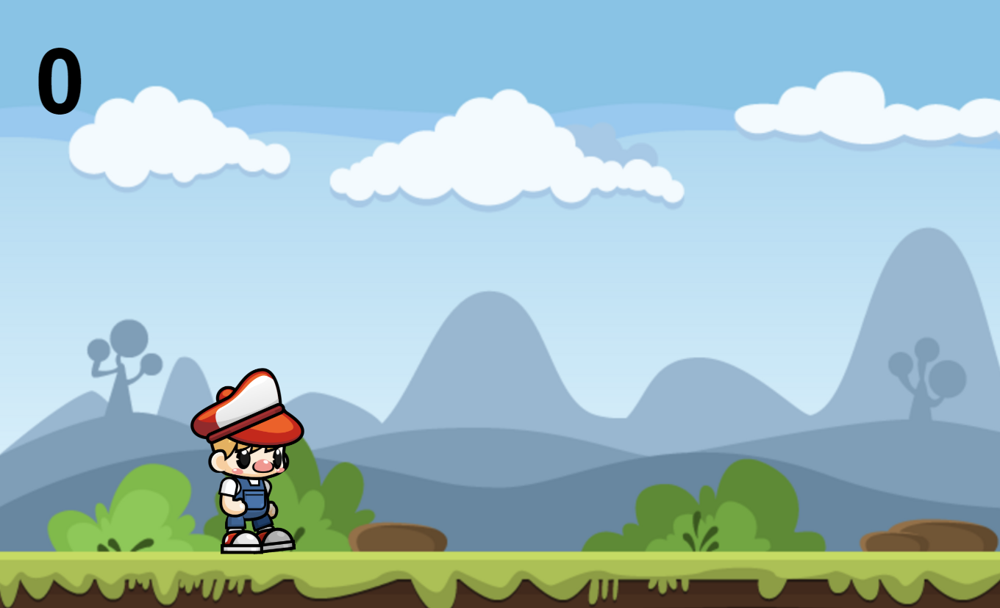
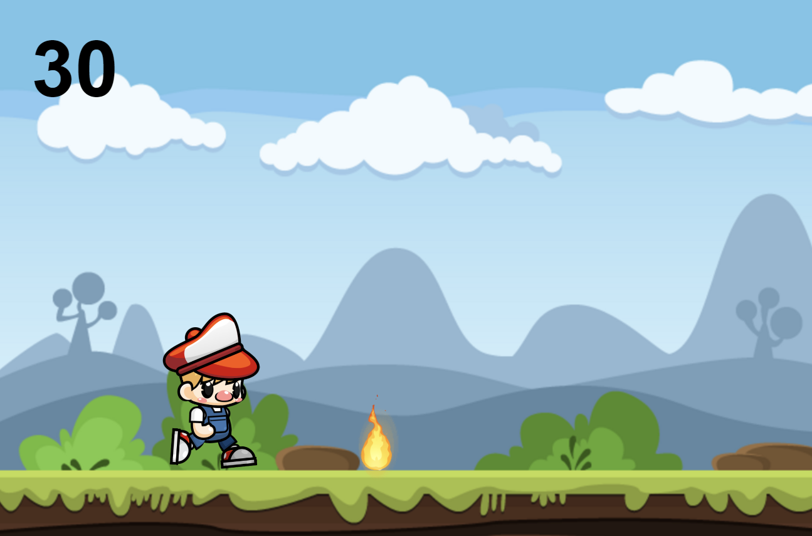
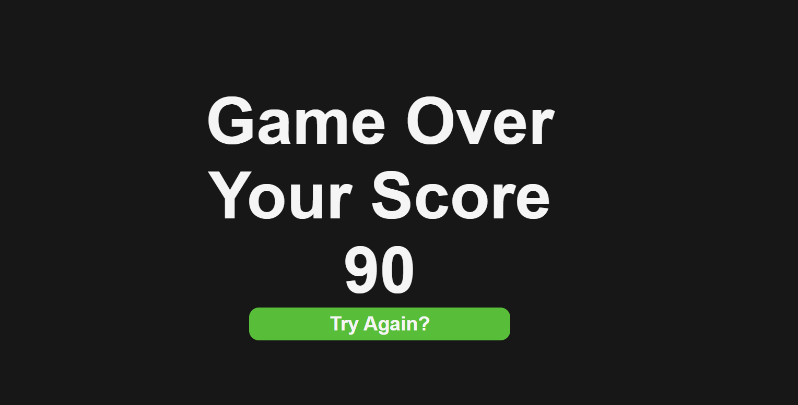

# 2D-Game-in-JS

### What is a 2D game?
2D games use flat graphics, called sprites, and don't have three-dimensional geometry. They're drawn to the screen as flat images, and the camera (orthographic camera) has no perspective.
### This is My 2D Game First Project
I tried to make a two-dimensional game with the javascript I learned. This is the result of that effort.

I am very happy. Because it's better than expected. :heartpulse: